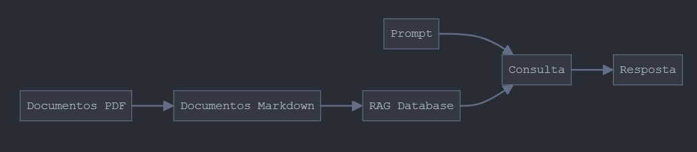

# Arquitetura

- Os documentos em PDF são primeiro convertidos para o formato Markdown
- Os documentos Markdown são então processados e armazenados no Banco de Dados RAG
- A consulta é composta por dois elementos principais:

    - Prompt fornecido pelo usuário
    - Dados recuperados do Banco de Dados RAG

A combinação desses elementos gera a resposta final

